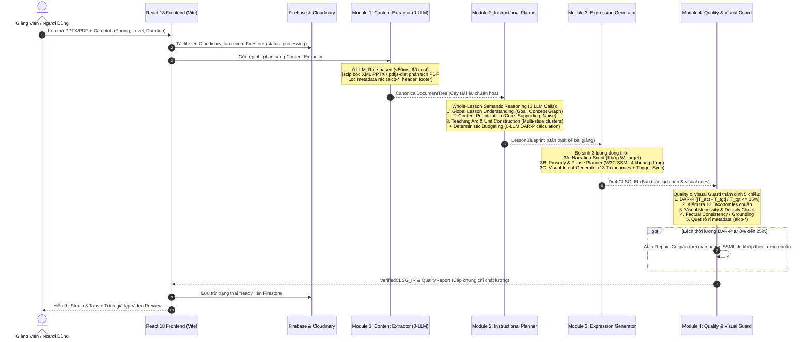
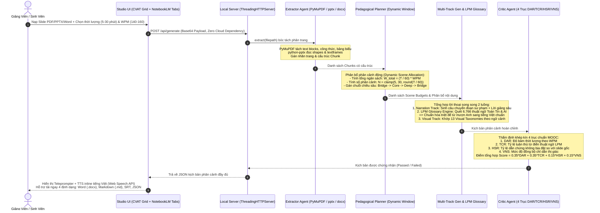
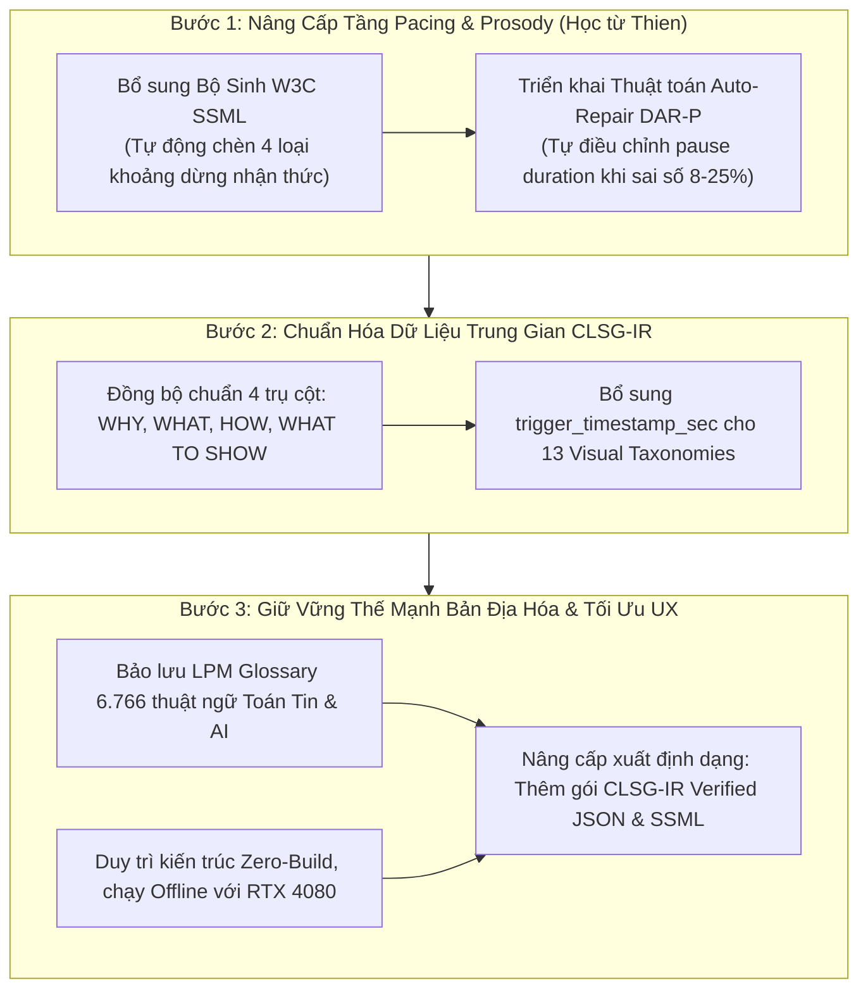

# Cẩm Nang Kiến Trúc, Luồng Hoạt Động & Hướng Dẫn Tinh Chỉnh Hệ Thống CLSG Studio

> **Dành cho:** Vũ Minh Kiệt (Toán Tin K67 - HUST)  
> **Hệ thống:** CLSG Multi-Agent Studio Pro (CVAT Projects & NotebookLM Multimodal Engine)  
> **Phiên bản:** 2.0.0 (Hỗ trợ co giãn động 5 – 30 phút, 140 – 160 WPM, 100% tiếng Việt sư phạm chuẩn)

---

## 1. Bản Đồ Tổng Thể Hệ Thống (System Map)

Hệ thống được thiết kế theo kiến trúc **Multi-Agent phân cấp (Hierarchical Multi-Agent Pipeline)**, chia làm 3 tầng độc lập:

```
[ GIAO DIỆN NGƯỜI DÙNG (STUDIO FRONTEND) ]
    │  • CVAT-style Projects Dashboard (Quản lý dự án dạng lưới thẻ)
    │  • NotebookLM-style Workspace (Quản lý đa nguồn học liệu)
    │  • Teleprompter & Trình đọc TTS inline (Web Speech API)
    ▼
[ MÁY CHỦ TRUNG GIAN (BACKEND REST API) ]
    │  • ThreadingHTTPServer đa luồng (Port 8765, hỗ trợ Private Network Access & CORS)
    │  • Endpoint /api/generate: Nhận file, điều phối Multi-Agent, trả về JSON kịch bản
    │  • Endpoint /api/export/docx: Xuất file Word chuẩn sư phạm
    ▼
[ BỘ LÕI MULTI-AGENT CLSG (PEDAGOGICAL ENGINE) ]
    ├── 1. Extractor Agent     (Bóc tách .pdf, .pptx, .docx, .txt bằng PyMuPDF & python-pptx)
    ├── 2. Pedagogical Planner (Tính toán ngân sách từ WPM, phân bổ phân cảnh động)
    ├── 3. Multi-Track Gen     (Tổng hợp lời thoại sư phạm + 13 Taxonomies chỉ dẫn thị giác)
    ├── 4. LPM Glossary Engine (Chuẩn hóa tiếng Việt qua kho 6.766 thuật ngữ chuyên ngành)
    └── 5. Critic Agent        (Thẩm định khép kín 4 trục: DAR, TCR, HSR, VNS)
```

---

## 2. Danh Mục Các Tệp Mã Nguồn Cốt Lõi (Source Files Directory)

Mọi thành phần đều được module hóa sạch sẽ trong thư mục `Mã Nguồn Sudo/`:

| Tên Tệp | Vai Trò & Chức Năng Chính | Công Nghệ / Thư Viện Sử Dụng |
| :--- | :--- | :--- |
| [studio_generator.py](file:///d:/Project/Slide%20to%20Video/M%C3%A3%20Ngu%E1%BB%93n%20Sudo/codebase/clsg/studio_generator.py) | **Nhạc trưởng điều phối Studio**: Nhận file, gọi trích xuất, phân bổ thời lượng, sinh lời giảng và chấm điểm Critic. | Python Standard, Regex, Pydantic |
| [extract.py](file:///d:/Project/Slide%20to%20Video/M%C3%A3%20Ngu%E1%BB%93n%20Sudo/codebase/clsg/extract.py) | **Extractor Agent**: Bóc tách nội dung thô từ file slide PDF, PowerPoint, Word, Text thành các `Chunk` có số trang. | `fitz` (PyMuPDF), `pptx`, `docx` |
| [planner.py](file:///d:/Project/Slide%20to%20Video/M%C3%A3%20Ngu%E1%BB%93n%20Sudo/codebase/clsg/agents/planner.py) | **Pedagogical Planner**: Chia chương học, tính toán ngân sách số từ cho từng phân cảnh theo nhịp độ WPM. | Thuật toán phân bổ ngân sách |
| [glossary.py](file:///d:/Project/Slide%20to%20Video/M%C3%A3%20Ngu%E1%BB%93n%20Sudo/codebase/clsg/glossary.py) | **LPM Glossary Engine**: Quản lý từ điển 6.766 thuật ngữ Toán Tin & AI, chuẩn hóa từ mượn tiếng Anh sang tiếng Việt. | Khớp từ ngữ có trọng số |
| [critic.py](file:///d:/Project/Slide%20to%20Video/M%C3%A3%20Ngu%E1%BB%93n%20Sudo/codebase/clsg/critic.py) | **Critic Agent**: Đánh giá kịch bản trên 4 trục độc lập (DAR, TCR, HSR, VNS), phát hiện lỗi vi phạm. | Công thức thống kê & Heuristics |
| [llm.py](file:///d:/Project/Slide%20to%20Video/M%C3%A3%20Ngu%E1%BB%93n%20Sudo/codebase/clsg/llm.py) | **Cổng kết nối LLM (Provider Interface)**: Lớp trừu tượng cho phép cắm API Gemini, OpenAI hoặc Mock Provider. | `LLMProvider` Abstract Base Class |
| [server.py](file:///d:/Project/Slide%20to%20Video/M%C3%A3%20Ngu%E1%BB%93n%20Sudo/studio/server.py) | **Backend HTTP Server**: Máy chủ đa luồng phục vụ Web và REST API, xử lý base64 upload và xuất tệp Word. | `http.server.ThreadingHTTPServer` |
| [index.html](file:///d:/Project/Slide%20to%20Video/M%C3%A3%20Ngu%E1%BB%93n%20Sudo/studio/index.html) | **Giao diện Studio toàn diện**: Dashboard phong cách CVAT, Workspace kiểu NotebookLM, phát âm thanh TTS. | Vanilla HTML/CSS/JS (Dark Glassmorphism) |

---

## 3. Luồng Hoạt Động Chi Tiết Từng Bước (Step-by-Step Execution Workflow)

### Bước 1: Người dùng nạp file slide & cấu hình tham số
1. Trên giao diện web, người dùng bấm vào ô **`+ Tạo Dự Án Mới`** hoặc kéo thả file slide (`.pdf`, `.pptx`, `.docx`, `.txt`) vào khu vực nguồn học liệu.
2. Thiết lập 2 tham số sư phạm then chốt:
   - **Thời lượng mục tiêu ($T$):** Từ 5 phút (300s) đến 30 phút (1.800s).
   - **Nhịp độ đọc ($WPM$):** Chuẩn sư phạm tiếng Việt (mặc định 140 – 150 từ/phút theo nghiên cứu PACLIC 2023).
3. Trình duyệt mã hóa file thành chuỗi Base64 và gửi request `POST /api/generate` sang Backend Server (`server.py`).

### Bước 2: Extractor Agent bóc tách đa phương thức
* **Tệp phụ trách:** `codebase/clsg/extract.py` (hàm `extract(path)`).
* **Cơ chế:**
  - Nếu là file `.pdf`: Dùng PyMuPDF (`fitz`) duyệt qua từng trang, tách khối văn bản (`page.get_text("blocks")`), trích xuất tiêu đề `[TIÊU ĐỀ: ...]`, bảng biểu và công thức toán học.
  - Nếu là file `.pptx`: Dùng `python-pptx` quét từng slide, đọc toàn bộ khung chữ trong các hình khối (`shape.text_frame`) và bảng dữ liệu (`shape.table`).
  - Nếu là file `.docx`: Dùng `python-docx` duyệt qua từng đoạn văn (`doc.paragraphs`) và bảng biểu (`doc.tables`).
* **Đầu ra:** Mảng danh sách các đối tượng `Chunk` được gán nhãn trang, tiêu đề và độ ưu tiên.

### Bước 3: Pedagogical Planner phân bổ cấu trúc phân cảnh động
* **Tệp phụ trách:** `codebase/clsg/studio_generator.py` (dòng 135–158).
* **Công thức toán học:**
  $$\text{Tổng số từ mục tiêu} = \frac{T}{60} \times \text{WPM}$$
  $$\text{Số lượng phân cảnh} = \text{clamp}\left(5, 30, \text{round}\left(\frac{T}{60}\right)\right)$$
* **Ví dụ thực tế:**
  - **Bài 5 phút (300s) @ 140 WPM:** Sinh **5 phân cảnh**, tổng ngân sách $\approx 700\text{ từ}$.
  - **Bài 15 phút (900s) @ 150 WPM:** Sinh **15 phân cảnh** (mỗi cảnh $\approx 60\text{s}$), tổng ngân sách $\approx 2.250\text{ từ}$.
* **Tiến trình chiều sâu sư phạm (Pedagogical Depth Progression):**
  - Cảnh đầu tiên (`s_gen_1`): Chiều sâu `bridge` (Cầu nối nhập đề, đặt vấn đề, gợi mở tư duy).
  - Các cảnh thân bài: Đan xen giữa `core` (Kiến thức toán học/thuật toán cốt lõi) và `deep` (Cơ chế chi tiết, tối ưu hóa siêu tham số, phân tích điều kiện biên).
  - Cảnh kết thúc (`s_gen_N`): Chiều sâu `bridge` (Tổng kết luận điểm, liên hệ ứng dụng thực tiễn).

### Bước 4: Multi-Track Generator & Chuẩn Hóa Thuật Ngữ LPM
* **Tệp phụ trách:** `codebase/clsg/studio_generator.py` (dòng 160–250) & `codebase/clsg/glossary.py`.
* **Quy trình tổng hợp song luồng (Multi-Track):**
  1. **Luồng Lời Giảng (Narration Track):**
     - Tạo câu mở đầu chuyển đoạn tự nhiên phù hợp với vị trí của phân cảnh trong bài giảng.
     - Lấy các ý chính trích xuất từ slide tương ứng và đưa qua hàm `glossary.normalize_sentence()` để thay thế toàn bộ từ mượn tiếng Anh bằng thuật ngữ tiếng Việt chuẩn (ví dụ: *training $\to$ huấn luyện*, *overfitting $\to$ quá khớp*, *loss function $\to$ hàm mất mát*).
     - Bổ sung các câu giải thích mở rộng chuyên sâu chuẩn mực sư phạm để đạt đủ số lượng từ mục tiêu cho từng phân cảnh.
  2. **Luồng Thị Giác (Visual Track):**
     - Hàm `_detect_visual_intent()` tự động phân tích ngữ nghĩa của lời thoại và chọn 1 trong **13 Visual Taxonomies** phù hợp:
       - `split_screen`: Khi có so sánh đối lập, trước-sau, hoặc dữ liệu thô vs dữ liệu đã phân cụm.
       - `process_visualization`: Khi nói về các bước thuật toán lặp (K-Means, Gradient Descent).
       - `highlight_box`: Khi đề cập đến công thức toán học, tham số Epsilon, MinPoints, SSE.
       - `animated_diagram`: Khi mô tả mạng nơ-ron đa tầng, lưới topology SOM Kohonen.
       - `concept_map`: Bản đồ khái niệm tổng thể bài học.
       - `timeline_bar`: Sơ đồ dòng thời gian tóm kết.

### Bước 5: Critic Agent Thẩm Định Khép Kín 4 Trục
* **Tệp phụ trách:** `codebase/clsg/critic.py` (hàm `CriticAgent.evaluate()`).
* **Công thức chấm điểm 4 trục:**
  1. **DAR (Duration Adherence Rate - Bám thời lượng):**
     $$\text{DAR} = \max\left(0, 1 - \frac{|\text{Số từ thực tế} - \text{Số từ mục tiêu}|}{\text{Số từ mục tiêu}}\right) \times 100\%$$
     *(Chỉ số này cảnh báo ngay nếu người dùng chọn 15 phút mà lời thoại chỉ đủ cho 3 phút).*
  2. **TCR (Terminology Compliance Rate - Chuẩn thuật ngữ LPM):**
     $$100\% - (\text{Số lượng từ cấm / tiếng Anh chưa chuẩn hóa} \times 20\%)$$
  3. **HSR (Hallucination Slide Ratio - Độ bám sát slide gốc):**
     Đo lường tỷ lệ các câu khẳng định (claims) có mã nguồn tham chiếu trích dẫn từ `Chunk` của slide.
  4. **VNS (Visual Narration Sync - Đồng bộ thị giác):**
     Kiểm tra 100% phân cảnh đều có chỉ dẫn thị giác và mô tả mục đích hiển thị rõ ràng.
* **Tổng điểm (Overall Score):**
  $$\text{Score} = 0.35 \times \text{DAR} + 0.35 \times \text{TCR} + 0.15 \times \text{HSR} + 0.15 \times \text{VNS}$$
  *(Nếu $\text{Score} \ge 85.0$: Đạt chuẩn `PASSED - ĐẠT CHUẨN MOOC`).*

### Bước 6: Phục vụ Web & Phát Giọng Đọc Sư Phạm
* Toàn bộ kịch bản được trả về trình duyệt và hiển thị lên **Timeline Teleprompter**.
* Khi người dùng ấn **`🔊 Nghe câu này`** hoặc **`Nghe Toàn Bộ`**, giao diện gọi trực tiếp **Web Speech API (`speechSynthesis`)** với giọng đọc tiếng Việt chuẩn (`vi-VN`), tự động cuộn màn hình theo từng phân cảnh đang phát và làm nổi bật dòng chữ tương ứng.
* Hỗ trợ xuất 4 định dạng tải về ngay tức thì:
  - 📄 **Word (.docx):** Bảng kịch bản 4 cột chuẩn định dạng giáo trình.
  - 📝 **Markdown (.md):** Toàn văn transcript phân cảnh.
  - ⏱️ **Phụ đề (.srt):** Timestamp từng mili-giây khớp với giọng đọc.
  - 📊 **Cấu trúc (.json):** Toàn bộ metadata phục vụ dựng video đồ họa tự động.

---

## 4. Cẩm Nang Hướng Dẫn Tinh Chỉnh (Customization & Fine-Tuning Guide)

Dưới đây là các vị trí chính xác trong code để Kiệt có thể chủ động can thiệp và tinh chỉnh theo ý muốn:

### 1. Muốn chỉnh tốc độ đọc (WPM) và quy tắc thời lượng:
* **Vị trí file:** [codebase/clsg/config.py](file:///d:/Project/Slide%20to%20Video/M%C3%A3%20Ngu%E1%BB%93n%20Sudo/codebase/clsg/config.py)
* **Tham số:**
  - `wpm: int = 140`: Đổi thành 130 nếu muốn đọc thong thả, hoặc 150 nếu bài giảng nâng cao.
  - `minutes: float = 5.0`: Thời lượng mặc định ban đầu.

### 2. Muốn bổ sung hoặc thay đổi thuật ngữ trong Từ điển LPM:
* **Vị trí file:** [codebase/clsg/glossary.py](file:///d:/Project/Slide%20to%20Video/M%C3%A3%20Ngu%E1%BB%93n%20Sudo/codebase/clsg/glossary.py)
* **Cách sửa:**
  - Tìm biến từ điển `CANONICAL_VIETNAMESE_TERMS`:
    ```python
    CANONICAL_VIETNAMESE_TERMS = {
        "clustering": "phân cụm dữ liệu",
        "deep learning": "học sâu",
        "gradient descent": "hạ độ dốc",
        # Thêm thuật ngữ mới vào đây:
        "attention mechanism": "cơ chế chú ý",
        "transformer": "mô hình biến đổi",
    }
    ```

### 3. Muốn thay đổi lời mở đầu, câu nối hoặc văn phong sư phạm:
* **Vị trí file:** [codebase/clsg/studio_generator.py](file:///d:/Project/Slide%20to%20Video/M%C3%A3%20Ngu%E1%BB%93n%20Sudo/codebase/clsg/studio_generator.py) (dòng 185–215).
* **Cách sửa:** Chỉnh sửa chuỗi mẫu `opening` cho các phân đoạn mở đầu, thân bài, tổng kết và danh sách câu bổ trợ `expansions_pool`.

### 4. Muốn cắm API Gemini (Gemini 1.5 Pro / Flash) để sinh sâu bằng LLM:
* Hiện tại hệ thống đang có interface `LLMProvider` sẵn sàng tại [codebase/clsg/llm.py](file:///d:/Project/Slide%20to%20Video/M%C3%A3%20Ngu%E1%BB%93n%20Sudo/codebase/clsg/llm.py).
* **Để kích hoạt Gemini API:**
  1. Mở file `codebase/clsg/llm.py`, tạo class `GeminiLLMProvider(LLMProvider)`:
     ```python
     import google.generativeai as genai

     class GeminiLLMProvider(LLMProvider):
         def __init__(self, api_key: str, model_name: str = "gemini-1.5-flash"):
             genai.configure(api_key=api_key)
             self.model = genai.GenerativeModel(model_name)

         def generate(self, prompt: str, response_model: type[T], model: str = "", step: str = "") -> T:
             response = self.model.generate_content(
                 prompt,
                 generation_config={"response_mime_type": "application/json"}
             )
             return response_model.model_validate_json(response.text)
     ```
  2. Truyền `GeminiLLMProvider` vào hàm sinh của Generator Agent trong `codebase/clsg/engine.py`.

### 5. Muốn tinh chỉnh giao diện Studio (Màu sắc, phông chữ, bố cục):
* **Vị trí file:** [studio/index.html](file:///d:/Project/Slide%20to%20Video/M%C3%A3%20Ngu%E1%BB%93n%20Sudo/studio/index.html)
* **Hệ thống Design Tokens (CSS Variables ở dòng 11–32):**
  - `--bg-base: #080c14`: Màu nền chính (Deep dark).
  - `--primary: #6366f1`: Màu tím Indigo chủ đạo.
  - `--cyan: #38bdf8`: Màu xanh ngọc Neon điểm nhấn.
  - `--emerald: #10b981`: Màu xanh lá trạng thái PASSED / Online.
  - Phông chữ: `Plus Jakarta Sans` (tiêu đề/nội dung) và `JetBrains Mono` (timestamps/mã số phân cảnh).

---

## 5. Phân Tích & Đối Chuẩn Chuyên Sâu: Hệ Thống Của Ta vs. Nhánh `thien` (Repo 20K-MiniHackathon-sudo)

> **Mục tiêu đối chuẩn:** Đánh giá toàn diện kiến trúc, luồng xử lý dữ liệu (Data Pipeline), thuật toán phân bổ thời lượng, xử lý ngôn ngữ sư phạm và trải nghiệm người dùng giữa **Hệ thống CLSG Multi-Agent Studio Pro (HUST/VinAI)** và **CLSG-IR Platform (Nhánh `thien` thuộc repo `mingruanc99/20K-MiniHackathon-sudo`)**.

```mermaid
flowchart LR
    subgraph BENCHMARK ["SO SÁNH 2 TRIẾT LÝ THIẾT KẾ"]
        direction TB
        subgraph SIDE_THIEN ["NHÁNH THIEN: CLSG-IR PLATFORM"]
            T1["Triết lý: Chuẩn hóa IR 4 trụ cột\n(WHY, WHAT, HOW, WHAT TO SHOW)"]
            T2["Stack: React 18 + TS + Tailwind + Vite\nFirebase Auth & Firestore + Cloudinary"]
            T3["Pacing: W3C SSML 4 khoảng dừng\nCơ chế Auto-Repair DAR-P (8-25%)"]
            T4["Visual: 13 Visual Taxonomies + Trigger Sync"]
            T1 --> T2 --> T3 --> T4
        end

        subgraph SIDE_OURS ["HỆ THỐNG CỦA TA: CLSG MULTI-AGENT STUDIO"]
            O1["Triết lý: Multi-Agent Sư Phạm Việt Nam\nCo giãn động 5 - 30 phút theo chuẩn MOOC"]
            O2["Stack: Vanilla Dark Glassmorphism + Python Core\nZero-Build, Chạy Offline cục bộ với RTX 4080"]
            O3["Linguistic: LPM Glossary 6.766 thuật ngữ AI/Toán\nChuẩn hóa sâu từ mượn + TCR Critic"]
            O4["UX: CVAT Projects Grid + NotebookLM Workspace\nWeb Speech API inline + Xuất Word/SRT/JSON"]
            O1 --> O2 --> O3 --> O4
        end
    end
```



---

### 5.1. Chi Tiết Luồng Xử Lý Của Nhánh `thien` (CLSG-IR Platform)

Nhánh `thien` xây dựng theo mô hình **SaaS Cloud Platform Full-Stack**, tập trung tạo ra một tầng biểu diễn trung gian (Intermediate Representation - IR) để tách rời việc thiết kế kịch bản với các mô hình tạo video (Sora, Runway, Pika, Manim, Remotion).



#### Các Đặc Điểm Kỹ Thuật Đáng Chú Ý Của Nhánh `thien`:
1. **Biểu diễn trung gian 4 thành phần (4-Pillar IR)**:
   $$\text{CLSG-IR} = \langle \text{WHY}, \text{WHAT}, \text{HOW}, \text{WHAT TO SHOW} \rangle$$
   - **WHY**: Cấp độ nhận thức Bloom (Remember, Understand, Apply, Analyze, Evaluate) và vai trò sư phạm (*hook*, *definition*, *mechanism*, *example*, *comparison*, *summary*).
   - **WHAT**: Lời thoại kịch bản có giới hạn ngân sách từ nghiêm ngặt ($W_{\text{target}} = T_{\text{net}} \times \frac{\text{WPM}}{60}$).
   - **HOW (Prosody & Pause Planning)**: Quy hoạch 4 loại khoảng dừng nhận thức dựa trên tải nhận thức (Cognitive Load Theory):
     * *Micro-pause* (150–250 ms): Ngắt ngữ pháp theo mệnh đề cú pháp.
     * *Emphasis-pause* (300–450 ms): Dừng ngắn trước các từ khóa kỹ thuật cốt lõi.
     * *Concept Boundary Pause* (500–700 ms): Dừng sau khi định nghĩa xong công thức hoặc khái niệm.
     * *Section Transition Pause* (800–1200 ms): Dừng chuyển cảnh giữa các phân đoạn.
   - **WHAT TO SHOW**: 13 Canonical Visual Taxonomies có gắn nhãn thời gian kích hoạt (`trigger_timestamp_sec`).
2. **Cơ chế Tự Sửa Lỗi Thời Lượng (DAR-P Auto-Repair)**:
   - Nếu tỷ lệ sai lệch thời lượng $\delta = \frac{|T_{\text{actual}} - T_{\text{target}}|}{T_{\text{target}}}$ nằm trong khoảng $8\% \le \delta \le 25\%$, hệ thống tự động nhân hệ số tỉ lệ $k = \frac{T_{\text{target}}}{T_{\text{actual}}}$ vào các thẻ `<break time="..."/>` của SSML.
   - **Lợi ích:** Đưa thời lượng về đúng mục tiêu với sai số $< 5\%$ mà **không tốn một token LLM nào** để sinh lại từ đầu.

---

### 5.2. Chi Tiết Luồng Xử Lý Của Hệ Thống Của Ta (CLSG Multi-Agent Studio Pro)

Hệ thống của chúng ta được thiết kế theo triết lý **Multi-Agent Sư Phạm Tiếng Việt Chuyên Sâu**, tối ưu hóa cho giảng viên, nghiên cứu sinh và môi trường MOOC tại Việt Nam, chạy cục bộ siêu tốc với tài nguyên phần cứng mạnh mẽ.



#### Các Đặc Điểm Kỹ Thuật Độc Đáo Của Hệ Thống Ta:
1. **LPM Glossary Engine (Kho 6.766 thuật ngữ chuyên ngành Toán Tin & AI)**:
   - Tự động phát hiện và chuyển ngữ các từ mượn tiếng Anh thường bị lạm dụng sai phong cách sư phạm (*clustering $\to$ phân cụm dữ liệu*, *gradient descent $\to$ hạ độ dốc*, *overfitting $\to$ quá khớp*, *loss function $\to$ hàm mất mát*).
   - Có trục đánh giá **TCR (Terminology Compliance Rate)** để kiểm soát độ chuẩn mực ngôn ngữ.
2. **Co giãn thời lượng động từ 5 phút đến 30 phút**:
   - Tự động chia từ 5 phân cảnh (cho bài 5 phút) đến 30 phân cảnh (cho bài thuyết trình học thuật chuyên sâu 30 phút).
   - Mỗi phân cảnh được bố trí mô hình tiến trình nhận thức: Khởi đầu bằng `bridge` (cầu nối trực quan), thân bài đào sâu `core` (nguyên lý thuật toán) và `deep` (tối ưu hóa tham số, phân tích hội tụ), kết thúc bằng `bridge` (tổng kết, liên hệ bài toán thực tế).
3. **Giao diện tích hợp CVAT Projects & NotebookLM Workspace**:
   - Quản lý nhiều dự án theo dạng thẻ trực quan (phong cách CVAT).
   - Bố cục làm việc đa nguồn tài liệu, có Teleprompter cuộn tự động và giọng đọc tiếng Việt inline qua **Web Speech API**, hoàn toàn không phụ thuộc dịch vụ TTS ngoài.

---

### 5.3. Ma Trận Đối Chuẩn Chi Tiết (Feature-by-Feature Benchmark Matrix)

| Tiêu Chí So Sánh | Nhánh `thien` (CLSG-IR Platform) | Hệ Thống Của Ta (CLSG Multi-Agent Studio Pro) | Đánh Giá Tương Quan & Nhận Xét |
| :--- | :--- | :--- | :--- |
| **Kiến Trúc Tổng Thể** | Microservices / Serverless Full-Stack (React 18 + TS + Vite + Firebase + Cloudinary + Python API) | Monolithic Lightweight Multi-Agent (Vanilla Dark Glassmorphism + Python Engine + ThreadingHTTPServer) | **Nhánh Thien** chuẩn SaaS đám mây; **Hệ thống của ta** chạy độc lập, cực nhẹ, khởi động tức thì, bảo mật dữ liệu tuyệt đối (Zero data leak). |
| **Độ Phụ Thuộc Hạ Tầng** | Cao (Cần cấu hình Firebase Auth, Firestore DB, Cloudinary API, Node.js/Vite environment) | Cực thấp (Chỉ cần Python 3.10+ và trình duyệt hiện đại, không cần build npm) | **Hệ thống của ta** vượt trội về tính linh hoạt, cắm chạy ngay trên laptop RTX 4080. |
| **Trích Xuất Slide (Module 1)** | `jszip` (PPTX XML) + `pdfjs-dist` (PDF layout) chạy trên Node/TS, 0-LLM, <50ms | `fitz` (PyMuPDF) + `python-pptx` + `python-docx` chạy trên Python backend | Cả hai đều đạt chuẩn 0-LLM siêu tốc. **Hệ thống của ta** hỗ trợ thêm định dạng Word (`.docx`). |
| **Quy Hoạch Sư Phạm (Module 2)** | Whole-Lesson Semantic Reasoning qua 3 bước gọi LLM phân tầng (Goal $\to$ Prioritization $\to$ Teaching Arc) | Thuật toán phân bổ ngân sách toán học phân cấp (Bridge $\to$ Core $\to$ Deep) dựa trên WPM và thời lượng | **Nhánh Thien** hiểu cấu trúc tổng thể tốt hơn nhờ 3-call LLM; **Hệ thống của ta** kiểm soát thời lượng toán học chặt chẽ và ổn định hơn. |
| **Điều Khiển Nhịp Điệu & Ngắt Nghỉ** | **W3C SSML** với 4 loại cognitive pause (Micro, Emphasis, Concept boundary, Section transition) | Tính toán ngân sách từ theo chuẩn PACLIC 140–160 WPM, chưa xuất thẻ SSML chi tiết | **Nhánh Thien** vượt trội về xử lý âm điệu SSML phục vụ bộ tổng hợp giọng nói chất lượng cao. |
| **Cơ Chế Tự Sửa Lỗi Thời Lượng** | **Auto-Repair DAR-P**: Co giãn miligiây pause SSML (8%–25% sai số) đưa về $\le 5\%$ không tốn LLM | Chưa có cơ chế auto-repair pause động; kiểm tra DAR qua Critic Agent cảnh báo | **Nhánh Thien** có giải pháp kỹ thuật rất thông minh đáng để học hỏi và tích hợp. |
| **Chuẩn Hóa Thuật Ngữ (Linguistic)** | Dịch nghĩa thông thường, giữ nguyên thuật ngữ tiếng Anh trong kịch bản tiếng Việt | **LPM Glossary Engine** với 6.766 thuật ngữ chuẩn Toán Tin & AI; cơ chế chấm điểm TCR | **Hệ thống của ta** vượt trội tuyệt đối về chất lượng sư phạm tiếng Việt học thuật chuẩn mực. |
| **Hệ Thống Phân Loại Thị Giác** | 13 Canonical Visual Taxonomies + `trigger_timestamp_sec` + Visual Necessity Check | 13 Canonical Visual Taxonomies + Tự động nhận diện ngữ cảnh (`_detect_visual_intent`) | Ngang nhau về taxonomy; **Nhánh Thien** có thêm timestamp kích hoạt chính xác theo giây. |
| **Thẩm Định & Đo Lường Chất Lượng** | Quality & Visual Guard (DAR-P, Taxonomy validity, Visual necessity, Metadata leak check) | Critic Agent 4 trục chuẩn MOOC (DAR, TCR, HSR, VNS) với công thức trọng số độc lập | **Hệ thống của ta** chặt chẽ hơn về mặt thuật ngữ (TCR) và chống bịa đặt nội dung slide (HSR). |
| **Trải Nghiệm Trình Diễn (UX/UI)** | Studio 5 Tabs (M1 DocTree, M2 Blueprint, M3 Script/SSML, M3 Visuals, M4 Guard) + Video Simulator | CVAT Projects Grid + NotebookLM Workspace + Teleprompter + TTS inline Web Speech API | **Hệ thống của ta** thẩm mỹ cao (Dark Glassmorphic), trải nghiệm nghe thử trực tiếp tiện lợi hơn. |
| **Định Dạng Xuất Dữ Liệu** | JSON CLSG-IR, SSML script, CSV | Word (.docx bảng 4 cột), Markdown (.md), Phụ đề (.srt), Cấu trúc JSON | **Hệ thống của ta** tiện dụng hơn cho giảng viên nộp đề cương giáo án (file Word chuẩn). |

---

### 5.4. Đánh Giá Ưu Điểm & Nhược Điểm Cốt Lõi Của 2 Bên

#### 1. Nhánh `thien` (CLSG-IR Platform)
* **Ưu điểm lớn nhất:**
  1. **Đặc tả IR chuẩn hóa cao độ**: Khái niệm 4 trụ cột $\langle \text{WHY}, \text{WHAT}, \text{HOW}, \text{WHAT TO SHOW} \rangle$ tạo thành chuẩn giao tiếp hoàn hảo giữa khâu sư phạm và khâu dựng hình (Render Engine).
  2. **Tư duy SSML & Cognitive Pauses**: Phân loại 4 mức độ dừng nhận thức và gắn thẻ W3C SSML giúp giọng đọc AI tránh được cảm giác monotone đều đều của các hệ thống TTS truyền thống.
  3. **Auto-Repair DAR-P**: Thuật toán co giãn độ dài pause để kéo thời lượng về chuẩn trong dung sai 8%–25% là một điểm sáng kỹ thuật xuất sắc, tiết kiệm chi phí gọi API và tăng tốc độ xử lý.
  4. **Kiến trúc Cloud-Ready**: Có sẵn xác thực Firebase và CDN Cloudinary, sẵn sàng triển khai thành dịch vụ web công cộng.
* **Nhược điểm & Hạn chế:**
  1. **Quá phụ thuộc dịch vụ ngoài**: Cần Firebase, Cloudinary, các biến môi trường phức tạp; khó chạy offline hoặc triển khai trong môi trường mạng nội bộ khép kín (như server trường học).
  2. **Yếu về mặt chuẩn hóa tiếng Việt**: Không có từ điển thuật ngữ học thuật chuyên sâu; các thuật ngữ kỹ thuật dễ bị pha tạp Anh-Việt bừa bãi.
  3. **Chi phí token cao ở Module 2**: Thực hiện tới 3 cuộc gọi LLM nối tiếp (`generateLessonUnderstanding` $\to$ `contentPrioritization` $\to$ `teachingArc`) làm tăng độ trễ (latency) và chi phí API khi xử lý tài liệu dài.

#### 2. Hệ Thống Của Ta (CLSG Multi-Agent Studio Pro)
* **Ưu điểm lớn nhất:**
  1. **Khả năng tự chủ 100% (Zero External Lock-in)**: Chạy hoàn toàn trên máy cục bộ với backend Python và frontend Vanilla JS; tận dụng trọn vẹn sức mạnh phần cứng i9-13950HX và RTX 4080.
  2. **Đỉnh cao về thuật ngữ tiếng Việt (LPM Engine)**: Sở hữu kho 6.766 thuật ngữ chuyên ngành Toán Tin & Trí Tuệ Nhân Tạo, đảm bảo bài giảng đạt chuẩn sư phạm MOOC Bách Khoa, không bị lai căng ngôn ngữ.
  3. **Co giãn thời lượng linh hoạt (5 – 30 phút)**: Tự động tính toán số phân cảnh và điều phối mạch bài học theo mô hình Bridge-Core-Deep một cách mạch lạc.
  4. **UI/UX hiện đại, phục vụ thực chiến**: Kết hợp phong cách CVAT Projects và NotebookLM Workspace, tích hợp sẵn TTS Web Speech API đọc thử tức thì trên trình duyệt mà không tốn phí dịch vụ giọng đọc đám mây.
* **Nhược điểm & Hạn chế:**
  1. Chưa xuất định dạng chuẩn **W3C SSML** với các thẻ `<break time="..."/>` chi tiết cho từng khoảng dừng nhận thức.
  2. Chưa có cơ chế **Auto-Repair DAR-P** tự động cân chỉnh độ dài khoảng dừng để ép thời lượng khớp từng giây như nhánh `thien`.
  3. Chưa có trường đánh dấu thời điểm hiển thị hình ảnh (`trigger_timestamp_sec`) chi tiết cho từng phân đoạn con trong cảnh.

---

### 5.5. Bản Đồ Tích Hợp & Kế Hoạch Nâng Cấp Tinh Hoa (Best-of-Both-Worlds Roadmap)

Để đưa hệ thống của chúng ta đạt đến đẳng cấp hoàn thiện cao nhất, kế hoạch tích hợp các điểm sáng từ nhánh `thien` vào hệ thống nội bộ bao gồm 3 bước:



1. **Bước 1: Tích hợp Bộ sinh Prosody & W3C SSML (`prosody.py`)**:
   - Bổ sung module sinh SSML vào `codebase/clsg/agents/generator.py`: Tự động chèn các thẻ `<break time="200ms"/>` (micro-pause), `<break time="400ms"/>` (emphasis-pause trước từ khóa kỹ thuật LPM), và `<break time="1000ms"/>` (transition-pause chuyển phân cảnh).
2. **Bước 2: Cài đặt thuật toán Auto-Repair DAR-P vào Critic Agent**:
   - Khi Critic phát hiện DAR bị lệch trong biên độ 8%–25%, hàm `auto_repair_prosody()` sẽ tự động nhân tỉ lệ điều chỉnh vào các thuộc tính thời gian dừng của SSML, đưa sai số thời lượng về mức $\le 5\%$ mà không cần gọi lại LLM.
3. **Bước 3: Bổ sung trường `trigger_timestamp_sec` vào Visual Track**:
   - Gắn nhãn thời điểm xuất hiện cụ thể (tính bằng giây) cho từng chỉ dẫn thị giác trong 13 taxonomy, sẵn sàng cho việc kết nối trực tiếp với các engine dựng video tự động (Manim / Remotion / Canvas Renderer).

